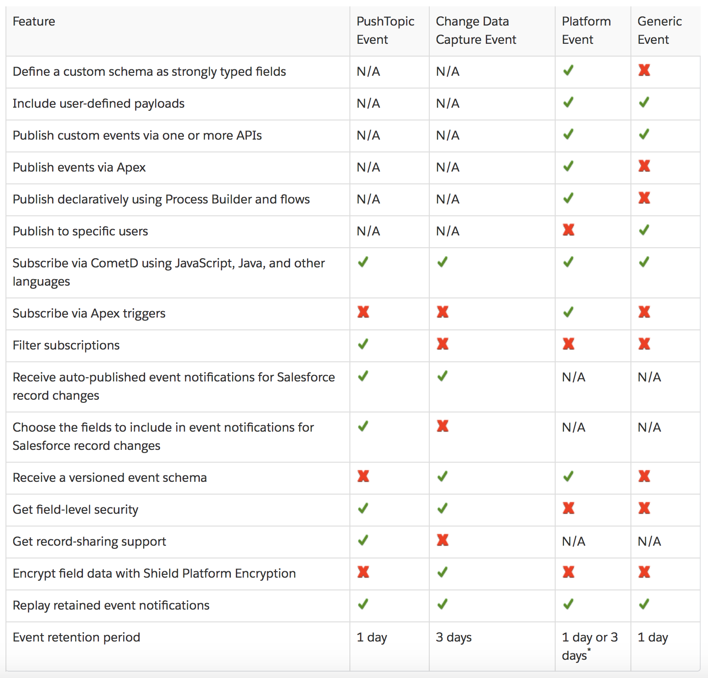
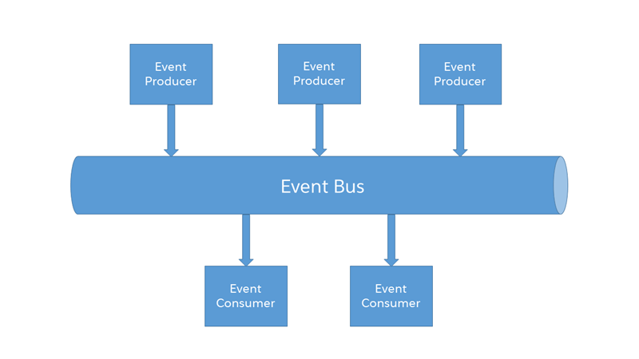
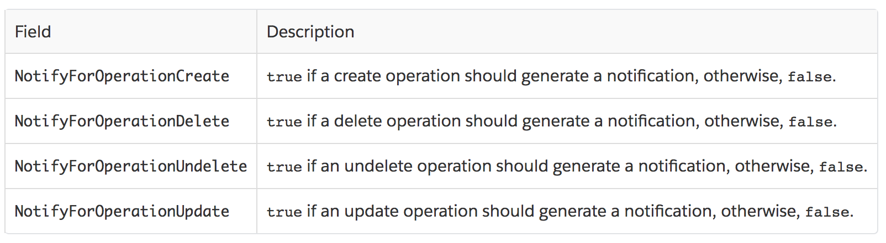
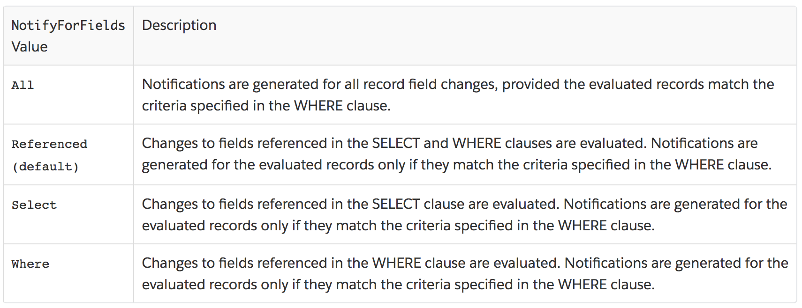
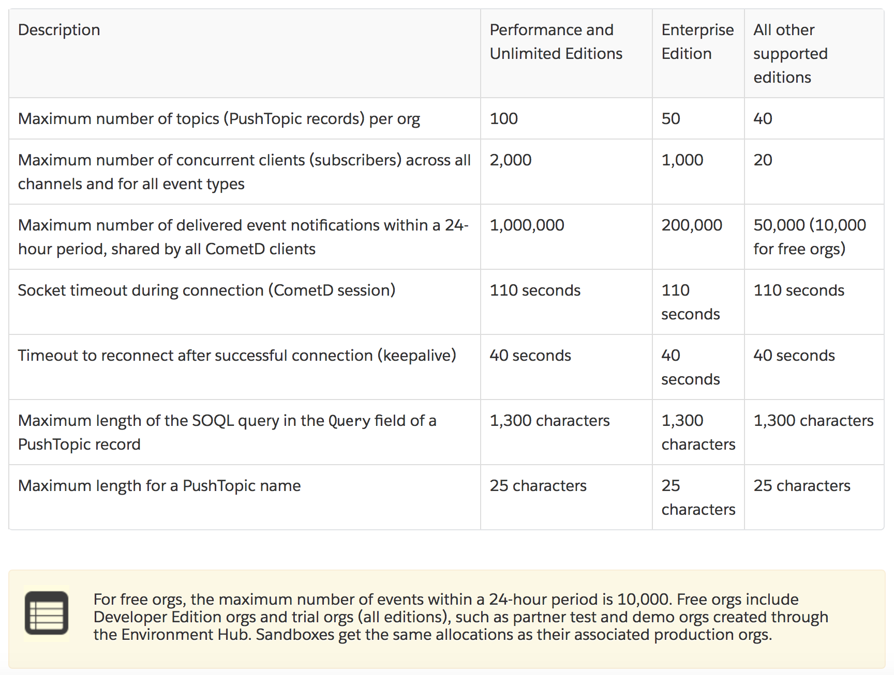
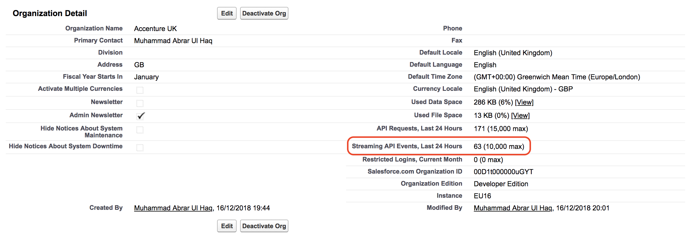

# Salesforce Streaming API Events

## Streaming API
<ul>
<li>Streaming API is a specialized API for setting up notifications that trigger when changes are made to Salesforce data.</li>
<li>It uses a publish-subscribe, or pub/sub, model in which users can subscribe to channels that broadcast certain types of data changes.</li>
<li>The pub/sub model reduces the number of API requests by eliminating the need for polling.</li>
<li>Streaming API is great for writing apps that would otherwise need to frequently poll for changes.</li>
</ul>

## Difference b/w Push and Pull Technology
<ul>
<li><b>Push technology (also called the publish/subscribe model)</b>, transfers information that is initiated from a Server to the Client.</li>
<li><b>Pull technology (also called constant/frequently polling)</b>, in which a request for information is made from a Client to the Server.</li>
</ul>

## Bayeux Protocol, CometD, and Long Polling
Streaming API uses the Bayeux protocol and CometD for long polling.
<ul>
<li>Bayeux is a protocol for transporting asynchronous messages, primarily over HTTP.</li>
<li>CometD is a scalable HTTP-based event routing bus that uses an AJAX push technology pattern known as Comet. It implements the Bayeux protocol.</li>
<li>Long polling, also called Comet programming, allows emulation of an information push from a server to a client. Similar to a normal poll, the client connects and requests information from the server. However, instead of sending an empty response if information isn't available, the server holds the request and waits until information is available (an event occurs). The server then sends a complete response to the client. The client then immediately re-requests information. The client continually maintains a connection to the server, so it’s always waiting to receive a response. In the case of server timeouts, the client connects again and starts over.</li>
<li>You can read more about long polling, Bayeux, or CometD, in the <a href="https://docs.cometd.org/" target="_blank" alt="CometD documentation.">CometD documentation.</a></li>
</ul>

## Applications for Streaming API
<ul>
<li><b>Applications That Poll Frequently:</b> Applications that have constant polling action against the Salesforce infrastructure, consuming unnecessary API calls and processing time, would benefit from Streaming API because it reduces the number of requests that return no data.</li>
<li><b>General Notification:</b> Use Streaming API for applications that require general notification of data changes in an org to reduce the number of API calls and improve performance.</li>
</ul>

## When to use Streaming API
<ul>
<li>Use Streaming API to receive near-real-time streams of data that are based on changes in Salesforce records or custom payloads.</li>
<li>For Salesforce record changes, Salesforce publishes notifications when the changes occur.</li>
<li>For custom notifications, you can publish event messages.</li>
<li>Subscribers can receive notifications using CometD—an implementation of the Bayeux protocol that simulates push technology.</li>
<li>Clients can subscribe to some types of events with Apex triggers or declaratively with Process Builder and flows.</li>
</ul>

## High Level Overview Events Features
<table>
	<tr>
		<th>API</th>
		<th>Protocol</th>
		<th>Data Format</th>
		<th>Communication</th>
	</tr>
	<tr>
		<td>Streaming API</td>
		<td>Bayeux</td>
		<td>JSON</td>
		<td>Asynchronous (stream of data)</td>
	</tr>
	<tr>
		<td>Platform Events</td>
		<td>CometD</td>
		<td>JSON</td>
		<td>Asynchronous (stream of data)</td>
	</tr>
</table>

## Streaming Events Features
<ol type="1">

<li>PushTopic</li>
<ul>
<li>A PushTopic triggers notifications for changes in Salesforce records resulting from a create, update, delete, or undelete operation. A PushTopic <b>notification is based on the criteria that you specify in the PushTopic record and the SOQL query that you define.</b> Only the fields specified in the query are included in the notification. The PushTopic defines a subscription channel.</li>
<li>Supported Objects: Account, Contact, Opportunity, Custom Objects</li>
<li>Channel = /topic/PushTopicName</li>
<li>
Sample JSON
	
```
{
	"clientId":"2t80j2hcog29sdh9ihjd9643a",
	"data":{
		"event":{
			"createdDate":"2016-03-29T16:40:08.208Z",
			"replayId":13,
			"type":"created"
		},
		"sobject":{
			"Website":null,
			"Id":"001D000000KnaXjIAJ",
			"Name":"TicTacToe"
		}
	},
	"channel":"/topic/TestAccountStreaming"
}
```
</li>
</ul>

<li>Change Data Capture (CDC)</li>
<ul>
<li>Receive changes to Salesforce records <b>with all changed fields</b>. Change Data Capture supports more standard objects than PushTopic events and provides more features, such as <b>header fields that contain information about the change.</b></li>
<li>Starting with <a href="https://releasenotes.docs.salesforce.com/en-us/spring19/release-notes/rn_data_change_events.htm" target="_blank" alt="Spring '19 release">Spring '19 release</a> Change Data Capture is now Generally Available (GA).</li>
<li>Channels:</li>
<li>For all change events—/data/ChangeEvents</li>
<li>For a specific standard object—/data/ObjectNameChangeEvent</li>
<li>For a specific custom object—/data/CustomObjectName__ChangeEvent</li>
<li>
Sample JSON

```
{
	"data": {
		"schema": "IeRuaY6cbI_HsV8Rv1Mc5g",
		"event": {
			"replayId": 6
		},
		"payload": {
			"ChangeEventHeader": {
				"entityName": "Account", 
				"recordIds": [
					"<record_ID>"
				], 
				"changeType": "CREATE", 
				"changeOrigin": "com.salesforce.core", 
				"transactionKey": "001b7375-0086-250e-e6ca-b99bc3a8b69f", 
				"sequenceNumber": 1, 
				"isTransactionEnd": true, 
				"commitTimestamp": 1501010206653, 
				"commitNumber": 92847272780, 
				"commitUser": "<User_ID>"
			}, 
			"Name": "Acme", 
			"Description": "Everyone is talking about the cloud. But what does it mean?", 
			"OwnerId": "<Owner_ID>", 
			"CreatedDate": "2017-07-25T19:16:44Z", 
			"CreatedById": "<User_ID>", 
			"LastModifiedDate": "2017-07-25T19:16:44Z", 
			"LastModifiedById": "<User_ID>"
		}
	}, 
	"channel": "/data/ChangeEvents"
}
```
</li>
</ul>

<li>Platform Event</li>
<ul>
<li>Publish and receive <b>custom payloads with a predefined schema</b>. The data can be anything you define, including business data, such as order information. Specify the data to send by defining a platform event. Subscribe to a platform event channel to receive notifications.</li>
<li>A Salesforce entity that represents the definition of the custom data that you send in a platform event message. You create a platform event and define its fields in Salesforce. The subscription channel is based on the platform event name.</li>
<li>Channel = /event/EventName__e</li>
<li>
Sample JSON

```
{
	"data": {
		"schema": "dffQ2QLzDNHqwB8_sHMxdA", 
		"event": {
			"replayId": 2
		},
		"payload": {
			"CreatedDate": "2017-04-09T18:31:40.517Z", 
			"CreatedById": "005D0000001cSZs", 
			"Printer_Model__c": "XZO-5", 
			"Serial_Number__c": "12345", 
			"Ink_Percentage__c": 0.2
		}
	}, 
	"channel": "/event/Low_Ink__e"
}
```
</li>
</ul>

<li>Generic Event</li>
<ul>
<li>Publish and receive <b>arbitrary payloads without a defined schema.</b></li>
<li>Channel = /u/notifications/GenericStreamingChannel</li>
<li>
Sample JSON

```
{
	"clientId":"a1ps4wpe52qytvcvbsko09tapc",
	"data":{
		"event":{
			"createdDate":"2016-03-29T19:05:28.334Z",
			"replayId":55
		},
		"payload":"This is a message."
	},
	"channel":"/u/TestStreaming"
}
```
</li>
</ul>

<li>High-Volume Platform Events</li>
<ul>
<li>Use high-volume platform events to publish and process millions of events efficiently.</li>
<li>Starting with <a href="https://releasenotes.docs.salesforce.com/en-us/spring19/release-notes/rn_messaging_high_volume_events.htm" target="_blank" alt="Spring '19 release">Spring '19 release</a> High-Volume Platform Events is now Generally Available (GA).</li>
</ul>

</ol>

## Replay Option
<ul>
<li>The ReplayId field value, which is populated by the system when the event is delivered to subscribers, refers to the position of the event in the event stream.</li>
<li>To replay events, use the Streaming API endpoint = https://Salesforce_Instance/cometd/44.0/</li>
<li>Replay ID: Subscriber receives all stored events after the event specified by its replayId value and new events.</li>
<li>-1 (Default Behaviour): Subscriber receives new events that are broadcast after the client subscribes.</li>
<li>-2: Subscriber receives all events, including past events that are within the retention window and new events.</li>
</ul>

## Compare Streaming Event Features
Reference from the <a href="https://developer.salesforce.com/docs/atlas.en-us.218.0.api_streaming.meta/api_streaming/event_comparison.htm" target="_blank" alt="Streaming API Developer Guide">Streaming API Developer Guide</a>.


## Considerations
<ul>
<li>If the client receives events, the client must reconnect immediately using CometD to receive the next set of events. If the reconnection doesn't occur within 40 seconds, the server expires the subscription, and the connection closes.</li>
<li>If no events are generated while the client is waiting and the server closes the connection, CometD must reconnect within 110 seconds. The Bayeux server sends a response to the client that contains the reconnect deadline of 110 seconds in the advice field.</li>
<li>The maximum size of the HTTP request post body that the server can accept from the client is 32,768 bytes.</li>
<li>Event Bus</li>
<li>Events are published to the event bus.</li>
<li>Subscribers retrieve events from a channel on the event bus.</li>
<li>The event bus decouples event publishers from event subscribers.</li>
<li>Reference from the <a href="https://developer.salesforce.com/docs/atlas.en-us.218.0.api_streaming.meta/api_streaming/using_streaming_api_durability.htm" target="_blank" alt="Streaming API Developer Guide">Streaming API Developer Guide</a>.</li>
<li></li>

## Prerequisites
<ul>
<li>The user must have API Enabled permission.</li>
<li>The user must enable Streaming API and Dynamic Streaming Channel Creation permissions under the User Interface section in Setup.</li>
<li>The user must have Read permission on the Push Topic standard object to receive notifications.</li>
<li>The user must have Create permission on the Push Topic standard object to create and manage PushTopic records.</li>
<li>The user must have Author Apex permission to create a PushTopic from the Developer Console.</li>
<li>To receive notifications, the user must have “Read” permission on the Streaming Channel standard object.</li>
<li>To create and manage notifications, the user must have “Create” permission on the Streaming Channel standard object.</li>
</ul>

## PushTopic
<ul>
<li><a href="https://developer.salesforce.com/docs/atlas.en-us.218.0.api_streaming.meta/api_streaming/pushtopic.htm" target="_blank" alt="Fields, Supported Calls and Special Access Rules of PushTopic Object">Fields, Supported Calls and Special Access Rules of PushTopic Object</a></li>
<li>
	
```
PushTopic pushTopic = new PushTopic();
pushTopic.Name = 'InvoiceStatementUpdates';
pushTopic.Query = 'SELECT Id, Name, Status__c, Description__c FROM Invoice_Statement__c';
pushTopic.ApiVersion = 44.0;
pushTopic.NotifyForOperationCreate = true;
pushTopic.NotifyForOperationUpdate = true;
pushTopic.NotifyForOperationUndelete = true;
pushTopic.NotifyForOperationDelete = true;
pushTopic.NotifyForFields = 'Referenced';
insert pushTopic;
```

```
SELECT Id, Name, Query FROM PushTopic
```

```
PushTopic pushTopicRecord = [SELECT Id, Name, Query FROM PushTopic WHERE Name = 'InvoiceStatementUpdates'];
delete pushTopicRecord;
```

<a href="https://developer.salesforce.com/docs/atlas.en-us.218.0.api_streaming.meta/api_streaming/deactivating_pushtopic.htm" target="_blank" alt="Deactivating a Push Topic">Deactivating a Push Topic</a>
```
PushTopic pt = new PushTopic(Id='0IFD0000000008jOAA', IsActive = false);
update(pt);
```
</li>

<li>Because NotifyForFields is set to Referenced, Streaming API will use fields in both the SELECT clause and the WHERE clause to generate a notification.</li>
<li>Whenever the fields Name, Status__c, or Description__c are updated, a notification will be generated on this channel.</li>
<li>
Reference from the <a href="https://developer.salesforce.com/docs/atlas.en-us.218.0.api_streaming.meta/api_streaming/events.htm" target="_blank" alt="Streaming API Developer Guide">Streaming API Developer Guide</a>.

</li>
<li>
Reference from the <a href="https://developer.salesforce.com/docs/atlas.en-us.218.0.api_streaming.meta/api_streaming/notifications.htm" target="_blank" alt="Streaming API Developer Guide">Streaming API Developer Guide</a>.

</li>

</ul>

## PushTopic Streaming Allocations
Reference from the <a href="https://developer.salesforce.com/docs/atlas.en-us.218.0.api_streaming.meta/api_streaming/limits.htm" target="_blank" alt="Streaming API Developer Guide">Streaming API Developer Guide</a>.


## Monitor PushTopic Event Usage in the Setup UI
Reference from the <a href="https://developer.salesforce.com/docs/atlas.en-us.218.0.api_streaming.meta/api_streaming/using_streaming_api_monitoring_events_usage_ui.htm" target="_blank" alt="Streaming API Developer Guide">Streaming API Developer Guide</a>.



## Subscribe to and Replay Events Using a Lightning Component
<ul>
<li>Reference from the <a href="https://developer.salesforce.com/docs/atlas.en-us.218.0.api_streaming.meta/api_streaming/code_sample_lightning_cmp.htm" target="_blank" alt="Streaming API Developer Guide">Streaming API Developer Guide</a>.</li>
<li>The <a href="https://developer.salesforce.com/docs/component-library/bundle/lightning:empApi/documentation" target="_blank" alt="lightning:empApi component">lightning:empApi component</a> uses a shared CometD-based Streaming API connection, enabling you to run multiple streaming apps in the browser.</li>
<li>To call the component’s methods, add the lightning:empApi component inside your custom component and assign an aura:id
attribute to it.</li>
<li></li>
<li>Then in the client-side controller, add functions to call the component methods.</li>
<li>All types of streaming events are supported, including:</li>
<li>PushTopic events</li>
<li>Change Data Capture events</li>
<li>Platform events</li>
<li>Generic events</li>
</ul>

## Useful Resources
<ul>
<li><a href="https://trailhead.salesforce.com/content/learn/modules/api_basics/api_basics_overview" target="_blank" alt="API Basics: When to Use Streaming API">API Basics: When to Use Streaming API</a></li>
<li><a href="https://trailhead.salesforce.com/content/learn/modules/api_basics/api_basics_streaming" target="_blank" alt="API Basics: Use Streaming API">API Basics: Use Streaming API</a></li>
<li><a href="https://developer.salesforce.com/docs/atlas.en-us.218.0.api_streaming.meta/api_streaming/intro_stream.htm" target="_blank" alt="Streaming API Developer Guide">Streaming API Developer Guide</a></li>
<li><a href="https://developer.salesforce.com/docs/atlas.en-us.218.0.platform_events.meta/platform_events/platform_events_intro_emp.htm" target="_blank" alt="Platform Events Developer Guide">Platform Events Developer Guide</a></li>
<li><a href="https://developer.salesforce.com/docs/atlas.en-us.218.0.change_data_capture.meta/change_data_capture/cdc_intro.htm" target="_blank" alt="Change Data Capture Developer Guide">Change Data Capture Developer Guide</a></li>
</ul>
